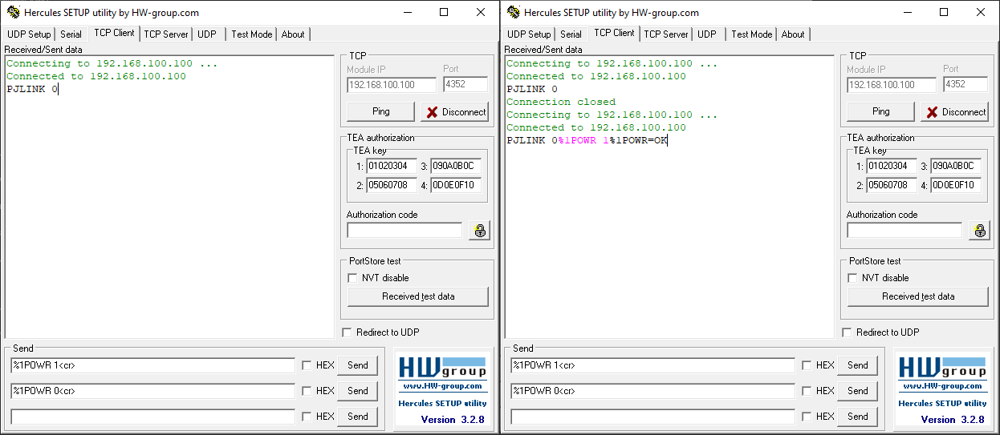
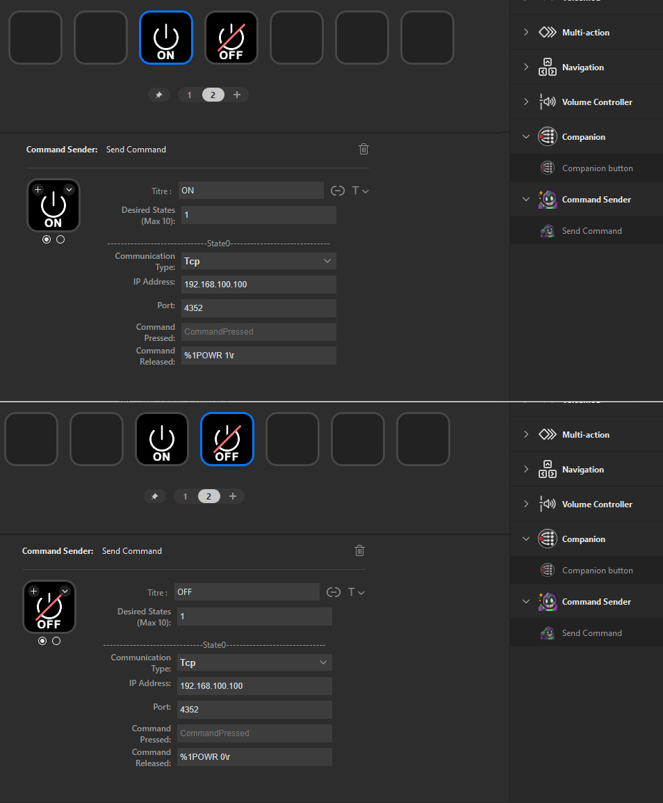
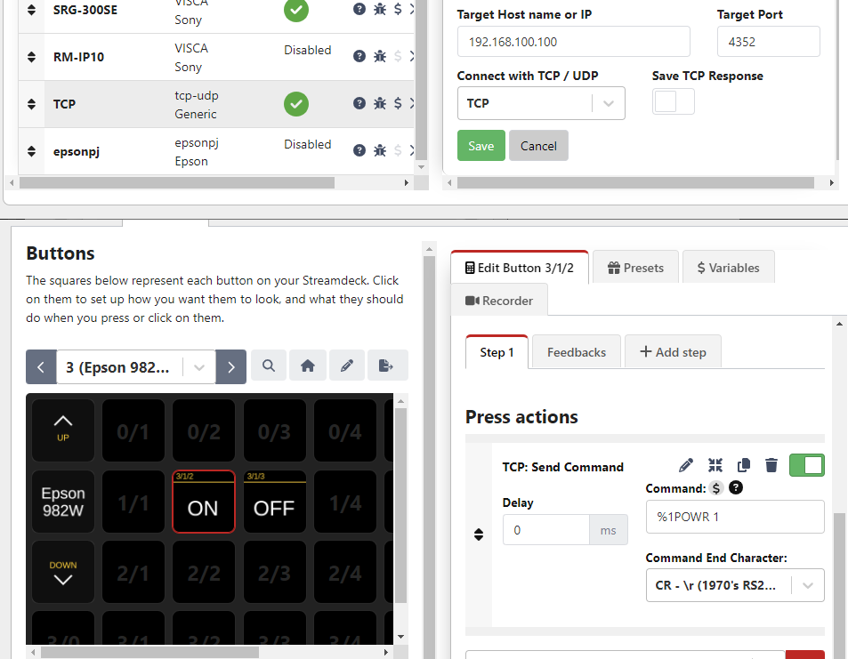

# README : Commandes PJLINK pour les Vidéoprojecteurs Epson

## Introduction

Ce guide a pour objectif de fournir une documentation complète sur l'envoi et la gestion des commandes PJLINK pour les vidéoprojecteurs Epson, notamment le modèle Epson 982W. L'objectif final est de pouvoir contrôler ces vidéoprojecteurs via divers outils, comme Companion, Streamdeck avec Command Sender, et Hercules, pour simplifier la gestion à distance de l'alimentation et d'autres fonctionnalités.

Nous avons exploré plusieurs méthodes, du protocole natif PJLINK aux requêtes HTTP observées via Companion, en passant par la capture et l'analyse des paquets réseau avec Wireshark. Ce guide compile ces découvertes pour vous aider à implémenter des solutions similaires.

## Prérequis

- **Vidéoprojecteur Epson 982W** ou un autre modèle compatible PJLINK
- **Elgato Streamdeck** avec Companion et Command Sender installés
- **Wireshark** pour capturer et analyser les paquets réseau
- **Hercules** pour tester l'envoi et la réception de commandes PJLINK
- **Python** pour l'exécution de scripts d'automatisation
- **Accès au réseau du vidéoprojecteur**

## 1. Outils Utilisés

### 1.1 Streamdeck et Command Sender

**Streamdeck** est un appareil programmable permettant de configurer des actions spécifiques via des boutons physiques. En combinaison avec le plugin **Command Sender**, il permet d'envoyer des commandes PJLINK au vidéoprojecteur, facilitant ainsi l'automatisation de tâches comme l'allumage ou l'extinction.

### 1.2 Companion

**Companion** est une application qui permet de contrôler plusieurs appareils via des commandes personnalisées. Nous avons exploré l'utilisation de Companion avec le module **EpsonPJ** et avons découvert des limitations, mais avons trouvé des solutions alternatives avec le module **TCP Generic**.

### 1.3 Wireshark

**Wireshark** est un outil de capture et d'analyse des paquets réseau. Il a été utilisé pour analyser les communications entre les vidéoprojecteurs Epson et d'autres dispositifs sur le réseau, permettant d'identifier les commandes PJLINK et HTTP échangées.

### 1.4 Hercules

**Hercules** est un outil de test réseau qui permet d'envoyer et de recevoir des paquets TCP. Il est particulièrement utile pour tester manuellement les commandes PJLINK et vérifier les réponses des vidéoprojecteurs avant de les automatiser.

### 1.5 Python

**Python** est un langage de programmation utilisé pour automatiser l'envoi de commandes PJLINK et pour l'analyse des réponses du vidéoprojecteur. Des scripts Python ont été développés pour détecter l'état du projecteur et envoyer des commandes en conséquence.

## 2. Configuration Initiale du Vidéoprojecteur

### 2.1 Activer PJLINK

Pour utiliser le protocole PJLINK, vous devez l'activer dans les paramètres réseau du vidéoprojecteur. Assurez-vous que le mot de passe est soit vide, soit configuré selon vos besoins.

### 2.2 Activer le Mode Réseau en Veille

Pour permettre la réception de commandes PJLINK même lorsque le projecteur est éteint, activez l'option **Network Standby**. Cela garantit que l'interface réseau reste active.

### 2.3 Configurer le Port PJLINK

Vérifiez que le port **4352** est utilisé pour les communications PJLINK, car il s'agit du port standard pour ce protocole.

## 3. Commandes PJLINK

### 3.1 Commandes de Base

Les commandes PJLINK permettent d'effectuer des actions simples comme allumer ou éteindre le vidéoprojecteur. Voici quelques exemples :

- **Allumer le projecteur** : `%1POWR 1`
- **Éteindre le projecteur** : `%1POWR 0`
- **Vérifier l'état du projecteur** : `%1POWR ?`

Ces commandes peuvent être envoyées via Companion, Command Sender ou Hercules en utilisant le bon format.
**Remarque:** Les fins de commandes peuvent être `<cr>`ou `\r`selon le logiciel utilisé.

### 3.2 Requêtes HTTP via Companion

Lors de nos essais avec le module **EpsonPJ** dans Companion, nous avons observé que les commandes HTTP incluent des paramètres complexes comme un `KEY` basé sur les premiers octets de l'adresse MAC du projecteur (exemple `KEY=6C`) et un `timestamp`. Ces commandes sont similaires à celles envoyées par l'interface web du projecteur, mais leur mise en œuvre via Companion reste problématique.

## 4. Test et Déploiement des Commandes

### 4.1 Utilisation de Hercules

Pour tester les commandes PJLINK :

1. **Connexion** : Configurez Hercules pour se connecter au port 4352 de l'IP du projecteur.
2. **Envoi des Commandes** : Testez les commandes `%1POWR 1<cr>` pour allumer le projecteur et `%1POWR 0<cr>` pour l'éteindre.
3. **Résultats** : Vous devriez recevoir des réponses confirmant l'exécution des commandes (`%1POWR=OK`).

### 4.2 Automatisation avec Command Sender

Configurez des boutons sur Stream Deck pour envoyer ces commandes via Command Sender :

- **Allumer** : `%1POWR 1\r`
- **Éteindre** : `%1POWR 0\r`

### 4.3 Companion avec le Module TCP Generic

Si vous préférez utiliser Companion, configurez le module TCP Generic pour envoyer les commandes PJLINK avec le paramètre de fin de ligne `CR - \r`.

## 5. Script Python pour le Scan et le Contrôle des Vidéoprojecteurs Epson

### [epson-list-videoproj.py]

Ce script Python est conçu pour scanner le sous-réseau local à la recherche de vidéoprojecteurs compatibles PJLink, identifier leur état actuel, et permettre de les allumer ou de les éteindre. Voici comment le script fonctionne :

1. **Scan du sous-réseau** : Le script scanne les adresses IP du sous-réseau pour trouver des appareils PJLink.
2. **Identification des vidéoprojecteurs** : Pour chaque appareil trouvé, il récupère son état actuel (allumé/éteint) et son nom.
3. **Contrôle des appareils** : L'utilisateur peut choisir un appareil et l'allumer ou l'éteindre en fonction de son état actuel.

Vous pouvez trouver ce script [ici](./epson-list-videoproj.py).

## 6. Analyse des Requêtes et Réponses

### 6.1 Capture des Paquets avec Wireshark

Utilisez Wireshark pour capturer les communications entre le projecteur et les outils utilisés. Les requêtes PJLINK et HTTP peuvent être analysées pour vérifier leur bonne transmission et réception.

### 6.2 Requêtes ARP et HTTP dans Companion

Companion envoie d'abord une requête ARP pour obtenir l'adresse MAC du projecteur, qui est ensuite utilisée dans les commandes HTTP. Ces commandes sont souvent accompagnées d'un `timestamp`, ce qui rend leur configuration manuelle plus complexe.

## 7. Conclusion

Ce projet vise à simplifier et automatiser le contrôle des vidéoprojecteurs Epson via le protocole PJLINK, en utilisant divers outils comme Stream Deck, Companion, et Hercules. Grâce à l'analyse approfondie des commandes et à la configuration appropriée des outils, il est possible de gérer efficacement plusieurs projecteurs dans un environnement professionnel.
