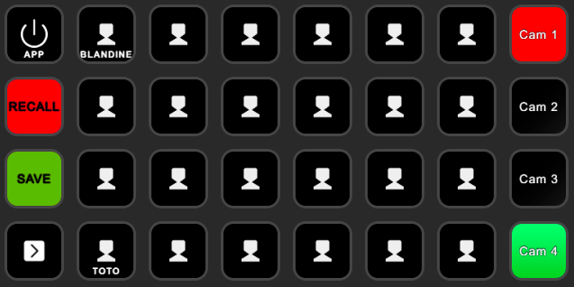

# StreamDeck XL Camera Control avec gestion avancée des presets et Tally

## Introduction

Ce projet permet de contrôler jusqu'à **4 caméras Sony BRC-Z700** via un **Stream Deck XL**, en utilisant des commandes **VISCA** pour gérer et rappeler des presets pour chaque caméra. Il inclut également l'intégration d'un système **Tally** via un **ATEM**, permettant d'afficher sur le **Stream Deck** quelles caméras sont en **Program** (rouge) et en **Preview** (vert).

Le projet prend en charge les modes **STORE** (enregistrement) et **RECALL** (rappel) des presets, avec un basculement simple entre ces deux modes via un bouton **toggle**.

## Fonctionnalités

1. **Contrôle multi-caméras avec presets** : Contrôlez jusqu'à 4 caméras et gérez les presets pour chacune d’elles.
2. **Modes STORE/RECALL** :
   - **STORE** : Enregistrement de presets via les boutons 1 à 6, 9 à 14, 17 à 22, 25 à 30.
   - **RECALL** : Rappel des presets via les mêmes boutons.
   - **Toggle** via le bouton 8 pour basculer entre les modes.
3. **Intégration Tally avec ATEM** : Les boutons 7, 15, 23, 31 affichent l'état **Program** (rouge) et **Preview** (vert) pour les caméras connectées à l'ATEM. Le Tally est mis à jour automatiquement en mode RECALL.
4. **Sauvegarde rapide des presets** : Enregistrez les presets dans un fichier `save.conf` via le bouton 16, qui est chargé automatiquement au démarrage du script.
5. **Verbose détaillé** : Le script affiche des messages dans la console pour chaque action (enregistrement/rappel de preset, changement de mode, etc.). Les logs incluent aussi la gestion des erreurs (commandes série, configuration).

## Aperçu des Modes

### Mode RECALL
En mode **RECALL**, le bouton **SAVE** est vert si toutes les configurations sont sauvegardées. Les boutons Caméras (7, 15, 23, 31) indiquent l'état **Program** (rouge) ou **Preview** (vert) pour les caméras connectées.



### Mode STORE
En mode **STORE**, le bouton **SAVE** devient orange dès qu'un changement non sauvegardé est détecté. Les caméras sont sélectionnables avec des boutons en bleu pour l'affichage actif.


## Prérequis

### Matériel requis :

- **Caméra Sony BRC-Z700**
- **Stream Deck XL** avec **32 boutons**
- **Adaptateur DB9/USB** pour connecter la caméra à votre PC
- **DSD TECH SH-G01B Isolateur USB** (pour éviter les interférences entre la télécommande RM-IP10 et l'ordinateur)
- **Python 3.x** installé sur votre ordinateur

### Installation de Python et des Dépendances

#### Étapes d'installation de Python :

1. **Téléchargez Python** depuis [python.org](https://www.python.org/downloads/).
2. **Installez Python** en cochant la case "Add Python to PATH" (Ajouter Python au PATH).
3. **Vérifiez l'installation** en ouvrant un terminal (ou PowerShell sur Windows) et en exécutant :
   ```bash
   python --version
   ```
   Vous devriez voir la version de Python installée.

#### Ajout de Python aux variables d'environnement

Si Python n’est pas trouvé dans votre PATH après l’installation :

1. **Ouvrez les Paramètres Système Avancés** sur Windows.
2. **Cliquez sur Variables d’environnement**.
3. **Ajoutez un nouveau chemin** vers le dossier d’installation de Python (exemple : `C:\Python39`) dans la variable PATH.

#### Installation des dépendances Python

Installez les bibliothèques nécessaires via **pip** :

```bash
pip install StreamDeck hidapi pyserial Pillow PyATEMMax
```

### Gestion des dépendances HIDAPI sur Windows

Si vous rencontrez des erreurs avec **hidapi**, suivez les étapes ci-dessous pour ajouter manuellement les fichiers **DLL** :

1. Téléchargez le fichier `hidapi.dll` depuis [hidapi releases](https://github.com/libusb/hidapi/releases).
2. Placez le fichier dans **C:\Windows\System32** (pour les systèmes 64-bit) ou **C:\Windows\SysWOW64** (pour les systèmes 32-bit).

## Utilisation

### Étapes pour utiliser le script :

1. **Connectez le Stream Deck XL** et les caméras à votre ordinateur.
2. **Connectez l'ATEM** pour gérer le Tally (adresse IP à configurer dans le script).
3. **Lancez le script** `streamdeck_XL.py`.
4. **Utilisez les boutons pour interagir** :
   - **Bouton 8** : Basculer entre le mode **STORE** et **RECALL**.
   - **Boutons 1 à 6, 9 à 14, 17 à 22, 25 à 30** : Enregistrer ou rappeler des presets selon le mode sélectionné.
   - **Boutons 7, 15, 23, 31** : Sélectionner la caméra en mode **STORE** et afficher l'état **Tally** en mode **RECALL**.
   - **Bouton 16** : Sauvegarder la configuration actuelle dans `save.conf`.

### Gestion des pages de boutons

Ce script gère plusieurs pages de boutons sur le Stream Deck XL, permettant d’assigner différents presets selon la page active :

1. **Navigation multi-page** : En appuyant sur les boutons de navigation du Stream Deck XL, vous pouvez passer entre les pages de boutons, chaque page étant configurée de manière indépendante.
2. **Enregistrement et rappel des presets par page** : Les boutons de preset fonctionnent en fonction de la page active, assurant ainsi une gestion multi-page des configurations de preset.

## Commandes VISCA pour la Caméra BRC-Z700

Les **commandes VISCA** permettent de contrôler la caméra via une connexion série.

### Enregistrement de preset

- **Enregistrer preset 1** : `81 01 04 3F 01 00 FF`
- **Enregistrer preset 2** : `81 01 04 3F 01 01 FF`

### Rappel de preset

- **Rappeler preset 1** : `81 01 04 3F 02 00 FF`
- **Rappeler preset 2** : `81 01 04 3F 02 01 FF`

## Fonctionnement

1. **Mode STORE** : Enregistrer des presets pour la caméra active. Si un preset existe déjà pour un bouton, il est écrasé.
2. **Mode RECALL** : Rappeler les presets enregistrés. Si un preset n'existe pas, une erreur est loggée.
3. **Gestion du Tally** : En mode RECALL, le Tally affiche les caméras en **Program** et **Preview** via l'ATEM.

## Sauvegarde et Chargement de la Configuration

Le fichier `save.conf` enregistre les presets pour chaque caméra et est chargé automatiquement au démarrage du script.

Exemple de fichier `save.conf` :

```json
{
    "preset_camera_map": [
        [1, 1],
        [2, 2],
        [3, 1],
        [4, 1]
    ],
    "camera_preset_count": {
        "1": 2,
        "2": 2,
        "3": 1,
        "4": 1
    }
}
```

## Arborescence des fichiers

Le projet est structuré comme suit :

```
📂 StreamDeck XL Camera Control
│
├── 📜 streamdeck_XL.py         # Fichier principal du script
├── 📜 streamdeck.py            # Gestion du Stream Deck
├── 📜 presets.py               # Gestion des presets (enregistrement, rappel, sauvegarde)
├── 📜 sequences.py             # Gestion des séquences (enregistrement, rappel, sauvegarde)
├── 📜 camera.py                # Commandes série VISCA
├── 📜 tally.py                 # Intégration Tally via ATEM
├── 📜 atem.py                  # Connexion à l'ATEM
└── 📜 display.py               # Création des images pour les boutons
```
