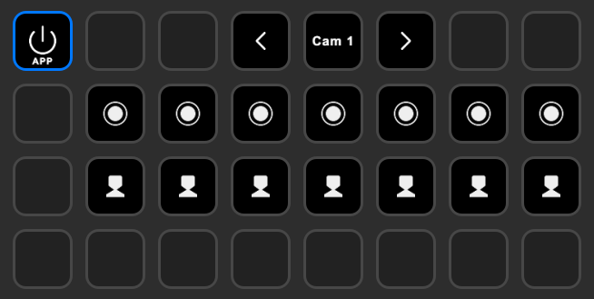

# StreamDeck XL Camera Control

## Introduction

Ce projet permet de contrôler plusieurs caméras (jusqu'à 8) à l'aide d'un Stream Deck XL et de commandes VISCA. Le script permet d'enregistrer et de rappeler des presets pour chaque caméra à partir du Stream Deck. Les utilisateurs peuvent changer de caméra, enregistrer des positions de preset et rappeler ces positions de manière intuitive via les boutons du Stream Deck.

Script `streamdeck_XL.py` complet [ici](./streamdeck_XL.py).

## Fonctionnalités

- **Sélection de la caméra active :**
  - Vous pouvez sélectionner la caméra active à l'aide des boutons de navigation `3` (pour diminuer le numéro) et `5` (pour l'augmenter). Les numéros de caméra vont de 1 à 8, et chaque sélection est accompagnée d'une mise à jour visuelle sur le Stream Deck.
  
- **Enregistrement des presets :**
  - Les boutons `9` à `15` permettent d'enregistrer des presets pour la caméra actuellement sélectionnée. Si un preset est déjà associé à un bouton, il peut être écrasé ou supprimé pour une autre caméra. L'objectif est de garantir que chaque caméra dispose de ses propres presets, et que ces derniers soient logiquement organisés (sans trous dans la séquence).
  - Le script gère intelligemment les "trous" dans les numéros de presets et tente toujours de combler les espaces vides avant de créer de nouveaux presets.

- **Rappel des presets :**
  - Les boutons `17` à `23` sont utilisés pour rappeler les presets associés à la caméra active. Si aucun preset n'est associé au bouton sélectionné, un message d'erreur est affiché.

- **Gestion des presets inter-caméras :**
  - Si vous enregistrez un preset sur un bouton déjà associé à une autre caméra, le preset est supprimé de l'ancienne caméra et remplacé par le nouveau preset pour la caméra actuelle. Cela permet d'assurer une gestion propre et efficace des presets sans chevauchement.

## Dépendances

Avant d'exécuter le script, vous devez installer les bibliothèques suivantes :

- `streamdeck` : pour communiquer avec le Stream Deck.
- `pyserial` : pour envoyer les commandes VISCA à la caméra.
- `Pillow` : pour gérer les images affichées sur le Stream Deck.

Vous pouvez les installer en exécutant la commande suivante :

```bash
pip install streamdeck pyserial Pillow
```

## Utilisation

1. **Connectez votre Stream Deck XL** à votre ordinateur.
2. **Connectez les caméras** que vous souhaitez contrôler via un port série (par défaut `COM8` est utilisé, mais cela peut être modifié dans le code).
3. Lancez le script `streamdeck_XL.py`.
4. Utilisez les boutons suivants pour interagir avec vos caméras :
   - **Boutons 3 et 5** : Sélectionner la caméra active (affichage visuel sur le bouton 4).
   - **Boutons 9 à 15** : Enregistrer des presets pour la caméra sélectionnée.
   - **Boutons 17 à 23** : Rappeler les presets enregistrés pour la caméra sélectionnée.
  


## Explications Techniques

- **Gestion des "trous" dans les presets** : Lorsqu'un preset est supprimé ou remplacé, le script garde une trace des numéros de preset disponibles pour chaque caméra. Cela garantit que les nouveaux presets comblent les "trous" avant d'incrémenter le numéro.
  
- **Écrasement de presets** : Si un preset est enregistré sur un bouton déjà utilisé pour une autre caméra, il est supprimé de la première caméra et enregistré pour la nouvelle. Cela assure une organisation efficace des presets.

- **Interface visuelle** : Le bouton 4 du Stream Deck affiche toujours le numéro de la caméra sélectionnée pour une indication rapide et visuelle.

## Exemple d'utilisation

```
Stream Deck prêt. Appuyez sur les boutons pour enregistrer/rappeler les presets et changer la caméra.
Le bouton avec l'ID 9 a été pressé.
Enregistrement du preset 1 pour la CAM 1
Envoi de la commande : 8101043f0100ff
Le bouton avec l'ID 9 a été relâché.
Le bouton avec l'ID 17 a été pressé.
Rappel du preset 1 pour la CAM 1
Envoi de la commande : 8101043f0200ff
Le bouton avec l'ID 17 a été relâché.
```

## Modifications Personnalisées

Le script peut être facilement modifié pour s'adapter à d'autres configurations ou à un autre matériel. Par exemple :
- **Changement du port série** : Modifiez la ligne `send_command(command, port='COM8')` pour utiliser un autre port.
- **Modification des boutons de contrôle** : Vous pouvez ajuster les plages de boutons pour enregistrer/rappeler des presets ou pour changer la caméra active.

## Remerciements

Ce projet a été une étape importante dans l'automatisation du contrôle de caméra avec un Stream Deck. Merci à toutes les parties impliquées dans le test et le développement de cette solution.
