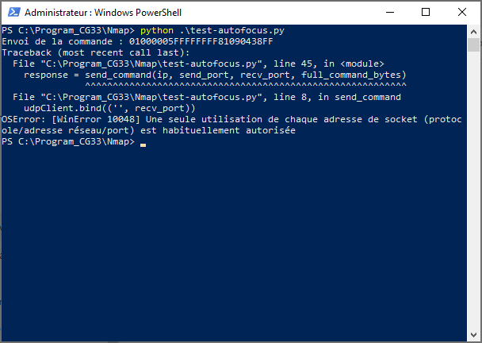
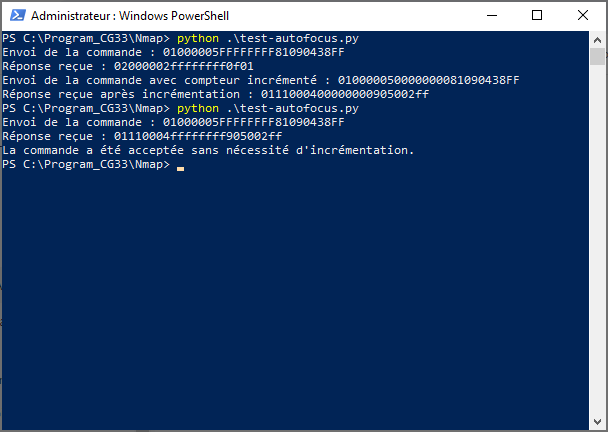
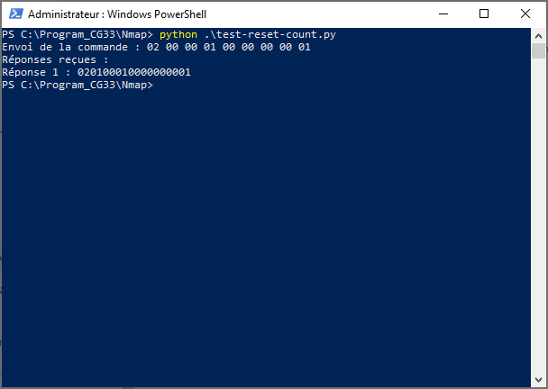
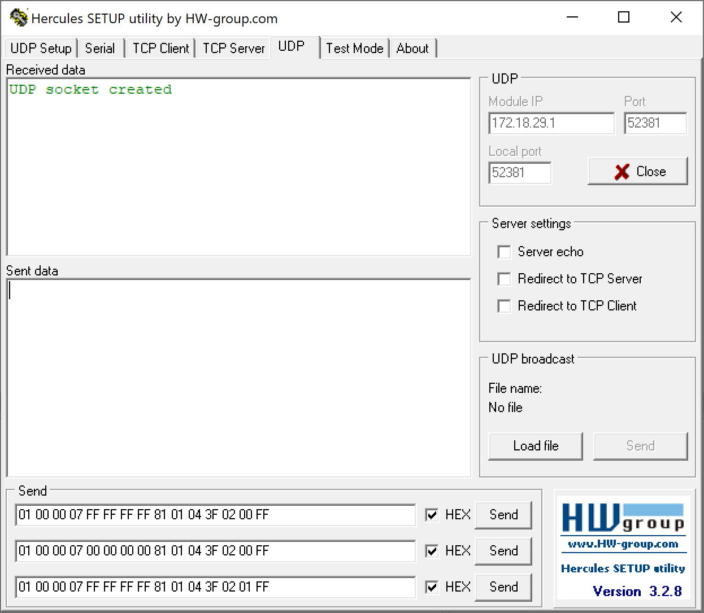
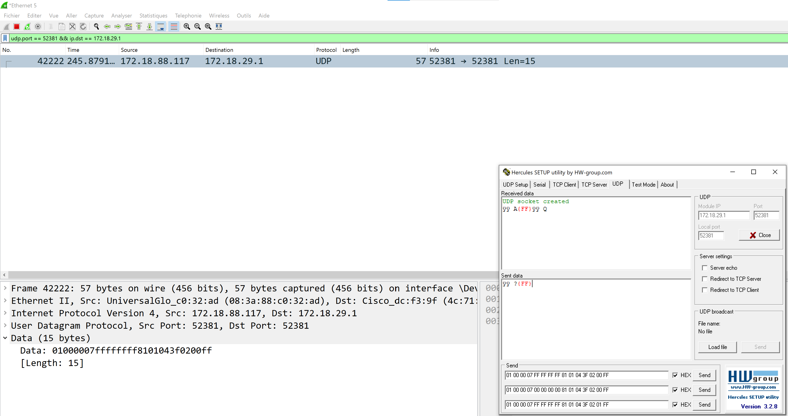
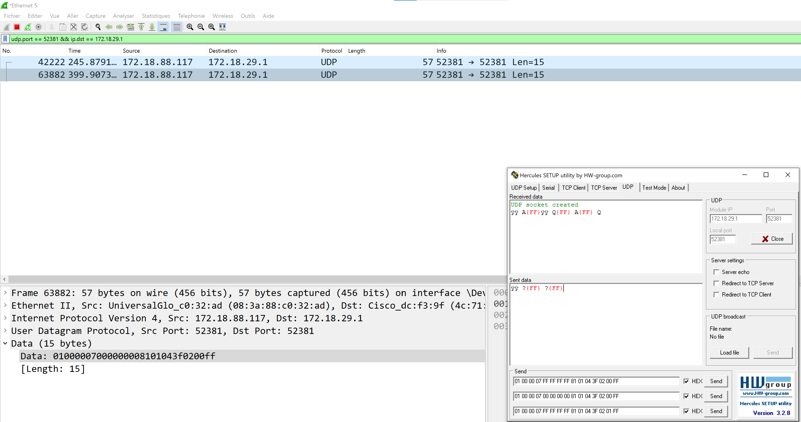
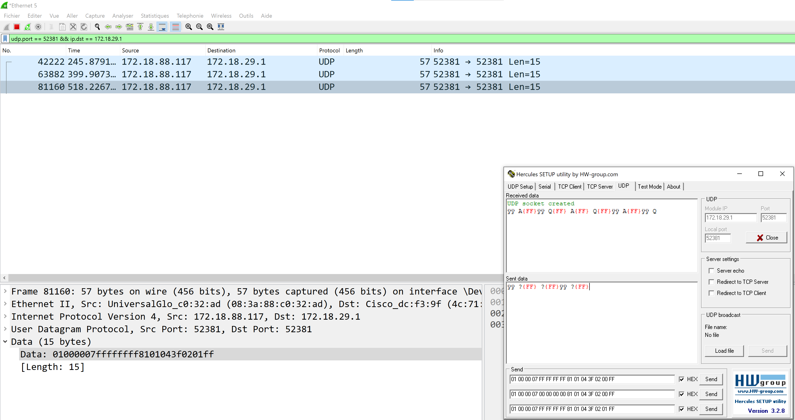
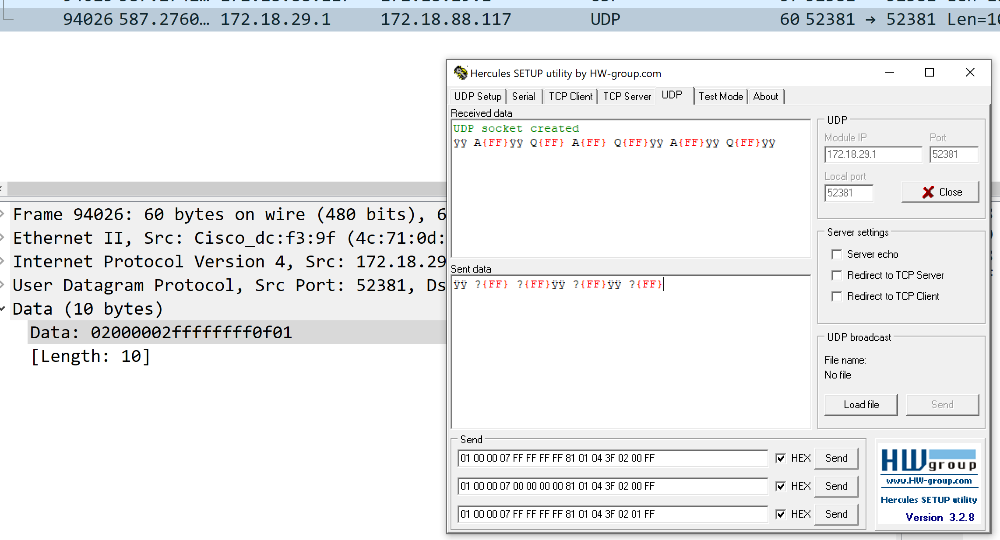

# README : Commandes VISCA pour les caméras Sony SRG-300SE et la télécommande RM-IP10

## Introduction

Ce guide a pour objectif de vous fournir une documentation complète sur l'envoi et la gestion des commandes VISCA pour les caméras Sony SRG-300SE via la télécommande RM-IP10. L'objectif final est de pouvoir piloter un ensemble de caméras de manière centralisée, comme si vous les contrôliez directement depuis la RM-IP10, en automatisant des séquences complexes telles que "caméra 1 > preset 2" suivi de "caméra 3 > preset 5". 

Pour atteindre cet objectif, nous avons suivi plusieurs étapes, allant de la compréhension des commandes de base à la capture et l'analyse des paquets réseau, en passant par l'automatisation des commandes via des outils comme Streamdeck et Companion.

## Prérequis

- **Caméra Sony SRG-300SE**
- **Télécommande RM-IP10**
- **Elgato Streamdeck** avec Companion et Command Sender installés
- **Wireshark** pour capturer et analyser les paquets réseau
- **Hercules** pour tester l'envoi et la réception de commandes réseau
- **Python** pour l'exécution de scripts d'automatisation

## 1. Outils Utilisés

### 1.1 Streamdeck et Command Sender

**Streamdeck** est un appareil programmable permettant de configurer des actions spécifiques via des boutons physiques. En combinaison avec le plugin **Command Sender**, il permet d'envoyer des commandes VISCA à la caméra, facilitant ainsi l'automatisation de séquences de contrôle.

### 1.2 Companion

**Companion** est une application qui permet de contrôler plusieurs appareils via des commandes personnalisées. Il dispose de modules spécifiques, comme le module **VISCA Sony**, qui permet de gérer les caméras Sony SRG-300SE.

### 1.3 Wireshark

**Wireshark** est un outil de capture et d'analyse des paquets réseau. Il permet de surveiller les communications entre la caméra, la RM-IP10 et d'autres appareils sur le réseau. C'est un outil essentiel pour identifier les commandes VISCA envoyées et les réponses reçues.

### 1.4 Hercules

**Hercules** est un outil de test réseau qui permet d'envoyer et de recevoir des paquets UDP et TCP. Il est particulièrement utile pour simuler l'envoi de commandes VISCA manuellement et vérifier les réponses de la caméra avant de les automatiser.

### 1.5 Python

**Python** est un langage de programmation utilisé pour automatiser l'envoi de commandes VISCA et pour l'analyse des réponses de la caméra. Les scripts Python permettent de gérer automatiquement les compteurs et de réinitialiser la caméra si nécessaire.

## 2. Comprendre les Commandes Hexadécimales

Les commandes VISCA que nous utilisons pour contrôler les caméras Sony SRG-300SE sont exprimées en hexadécimal. Cependant, lorsqu'elles sont intégrées dans des scripts ou envoyées via des outils comme **Streamdeck** (avec le plugin **Command Sender**), ces commandes doivent être formatées de manière spécifique. Voici comment cela fonctionne :

### 2.1 Représentation en Hexadécimal

Les commandes VISCA sont généralement exprimées en hexadécimal sous cette forme :

```plaintext
01 00 00 07 FF FF FF FF 81 01 04 3F 02 00 FF
```

Chaque paire de chiffres hexadécimaux (par exemple, `01`, `00`, `FF`, etc.) représente un octet (8 bits). Ces commandes sont envoyées telles quelles lorsqu'on utilise des outils comme **Hercules** ou **Wireshark** pour tester ou capturer les paquets.

### 2.2 Conversion en Chaîne de Caractères en Python ou Streamdeck

Pour envoyer ces mêmes commandes via un script Python ou via Streamdeck avec **Command Sender**, chaque octet hexadécimal doit être converti en sa représentation de caractère binaire équivalent. En Python, cela se fait en préfixant chaque octet par `\x` :

- **Commandes en Hexadécimal** :
  ```plaintext
  01 00 00 07 FF FF FF FF 81 01 04 3F 02 00 FF
  ```
  
- **Représentation en Chaîne de Caractères** :
  ```plaintext
  \x01\x00\x00\x07\xFF\xFF\xFF\xFF\x81\x01\x04\x3F\x02\x00\xFF
  ```

### 2.3 Pourquoi cette Conversion est-elle Nécessaire ?

Lorsqu'une commande est envoyée depuis un script ou un logiciel qui interprète les chaînes de caractères (comme Python ou Streamdeck), chaque caractère doit être représenté de manière à ce que l'interpréteur comprenne qu'il s'agit d'une séquence d'octets spécifique, et non simplement de texte. La notation `\x` indique au système que ce qui suit est un code hexadécimal représentant un octet.

### 2.4 Exemple Concret

- **Commande en Hexadécimal pour Rappel de Preset 1** :
  ```plaintext
  01 00 00 07 FF FF FF FF 81 01 04 3F 02 00 FF
  ```
  
- **Commande Représentée en Chaîne de Caractères pour un Script Python ou Streamdeck** :
  ```plaintext
  \x01\x00\x00\x07\xFF\xFF\xFF\xFF\x81\x01\x04\x3F\x02\x00\xFF
  ```

### 2.5 Applications

- **Streamdeck avec Command Sender** : Lorsque vous configurez un bouton dans Streamdeck pour envoyer une commande VISCA, vous devez utiliser la version chaîne de caractères avec `\x` pour que le logiciel puisse interpréter et envoyer correctement la commande.
  
- **Scripts Python** : Lorsque vous écrivez un script pour envoyer des commandes VISCA à la caméra, vous devez également utiliser cette notation pour que Python puisse envoyer la commande en tant que suite d'octets correcte.

En comprenant ce lien entre la notation hexadécimale et la chaîne de caractères, vous pourrez plus facilement déboguer, configurer, et automatiser vos commandes VISCA, que ce soit via un script ou un outil d'automatisation comme Streamdeck.

## 3. Identification des Commandes VISCA

### Capturer les Paquets avec Wireshark

Utilisez Wireshark pour capturer les paquets envoyés à et depuis la caméra ou la télécommande RM-IP10. Pour capturer uniquement les paquets pertinents, utilisez le filtre suivant :

```plaintext
udp.port == 52381
```

### Analyse des Paquets Capturés

En analysant les paquets capturés, nous avons découvert que les commandes de rappel de preset envoyées directement à la caméra Sony SRG-300SE avaient un préfixe `01 00`, tandis que celles envoyées depuis la RM-IP10 utilisaient un préfixe `01 10`.

- **Rappel du Preset 1 directement à la caméra** :
  ```plaintext
  01 00 00 07 FF FF FF FF 81 01 04 3F 02 00 FF
  ```
  
- **Rappel du Preset 1 depuis la RM-IP10** :
  ```plaintext
  01 10 00 07 FF FF FF FF 81 01 04 3F 02 00 FF
  ```

### Clarification supplémentaire : Différence entre les préfixes `01 00` et `01 10`

Dans nos tests, nous avons identifié deux préfixes différents dans les commandes VISCA : `01 00` et `01 10`. Voici une explication sur la manière dont ces préfixes ont été capturés et leur signification potentielle :

- **Préfixe `01 00`** : Ce préfixe a été capturé en utilisant **Wireshark** pour analyser les commandes envoyées directement depuis **Companion** avec le module **VISCA Sony**. Ces commandes sont destinées directement à la caméra Sony SRG-300SE.

- **Préfixe `01 10`** : Ce préfixe a été plus difficile à capturer. Il est utilisé par la télécommande **RM-IP10** pour communiquer avec la caméra. Cependant, il n'est pas possible de capturer directement ces paquets lorsque la télécommande envoie les commandes à la caméra. Pour contourner ce problème, nous avons débranché la caméra Sony et avons configuré l'adresse IP de notre PC pour qu'elle corresponde à celle de la caméra (172.18.29.1). Cette configuration a permis à notre PC de "se faire passer" pour la caméra, interceptant ainsi les paquets envoyés par la RM-IP10. En utilisant **Wireshark**, nous avons pu capturer ces paquets et identifier le préfixe `01 10` dans les commandes.

Cette différence de préfixe indique que la RM-IP10 utilise une structure légèrement différente dans ses commandes par rapport à celles envoyées directement depuis un logiciel comme Companion. Cette distinction pourrait être due à la manière dont la télécommande gère la communication avec plusieurs appareils ou à des exigences spécifiques du protocole réseau utilisé par la RM-IP10.

## 4. Commandes VISCA Identifiées

### Types de Commandes

Il est

 crucial de bien structurer les commandes VISCA pour qu'elles soient interprétées correctement par la caméra. Chaque type de commande utilise un préfixe spécifique suivi d'un compteur et termine par la commande proprement dite.

- **Inquiry (info)** : Utilisé pour interroger l'état ou obtenir des informations de la caméra, comme l'état de l'autofocus.
  - Préfixe : `01 00 00 05`
  - Compteur : `FF FF FF FF`
  - Commande : `81 09 04 38 FF`
  - Exemple : `01 00 00 05 FF FF FF FF 81 09 04 38 FF` pour interroger l'état de l'autofocus.
  
- **Settings (framing)** : Utilisé pour configurer ou ajuster certains paramètres de la caméra, comme le rappel de presets.
  - Préfixe : `01 00 00 07`
  - Compteur : `FF FF FF FF`
  - Commande : `81 01 04 3F 02 00 FF`
  - Exemple : `01 00 00 07 FF FF FF FF 81 01 04 3F 02 00 FF` pour rappeler un preset.
  
- **Command (movements)** : Utilisé pour contrôler les mouvements physiques de la caméra, tels que le pan, tilt, ou zoom.
  - Préfixe : `01 00 00 09`
  - Compteur : `FF FF FF FF`
  - Commande : `81 01 06 01 0C 0C 01 03 FF`
  - Exemple : `01 00 00 09 FF FF FF FF 81 01 06 01 0C 0C 01 03 FF` pour un mouvement vers la gauche.

### Forçage / Réinitialisation du Compteur

L'utilisation de `FF FF FF FF` sert de mécanisme de "forçage" ou de "réinitialisation" du compteur lorsque l'état actuel du compteur est inconnu. Après avoir envoyé une commande avec `FF FF FF FF`, la prochaine commande doit logiquement commencer avec `00 00 00 00`, qui est le premier incrément. À partir de là, on peut soit continuer à incrémenter le compteur pour envoyer les commandes suivantes (`00 00 00 01`, `00 00 00 02`, etc.), soit réinitialiser pour garantir la bonne exécution des prochaines commandes en envoyant 2 commandes à la suite grâce aux 2 états possibles sur un bouton, "Pressed" et "Released" comme décrit ci-dessous :

#### Exemple de Commande de Rappel de Preset avec des boutons `Command Sender` avec `Streamdeck` :

- **Preset 1** :
  - **Pressed** :  \x01\x00\x00\x07`\xFF\xFF\xFF\xFF`\x81\x01\x04\x3F\x02\x00\xFF
  - **Released** : \x01\x00\x00\x07`\x00\x00\x00\x00`\x81\x01\x04\x3F\x02\x00\xFF

- **Preset 2** :
  - **Pressed** : \x01\x00\x00\x07`\xFF\xFF\xFF\xFF`\x81\x01\x04\x3F\x02\x01\xFF
  - **Released** : \x01\x00\x00\x07`\x00\x00\x00\x00`\x81\x01\x04\x3F\x02\x01\xFF

### Commandes d'Interrogation (Inquiry Commands)

Les commandes d'interrogation (pour vérifier l'état d'une fonctionnalité comme l'autofocus) utilisent généralement un préfixe `01 00 00 05` suivi de la commande VISCA spécifique.

- **Exemple d'Interrogation de l'Autofocus** :
  ```plaintext
  01 00 00 05 FF FF FF FF 81 09 04 38 FF
  ```

- **Réponse Typique** :
  - Autofocus activé : `01110004ffffffff905002ff`
  - Autofocus désactivé : `01110004ffffffff905003ff`

### Autre Commande de réinitialisation observée chez Companion :

Nous avons observé que la commande de réinitialisation envoyée depuis Companion à la caméra utilise `020000010000000001`. Cette commande réinitialise également le compteur à `00 00 00 00`.

## 5. Envoi et Réception des Commandes via Scripts Python

Les scripts Python permettent d'automatiser l'envoi et la réception des commandes VISCA, ce qui est particulièrement utile pour interroger des états ou réinitialiser des compteurs.

### [test-autofocus.py]

Ce script envoie une commande d'interrogation de l'état de l'autofocus à la caméra et analyse la réponse pour déterminer si l'autofocus est activé ou désactivé. Le script ajuste également le compteur en fonction des réponses de la caméra.

### [test-reset-count.py]

Ce script envoie la commande `020000010000000001` pour réinitialiser le compteur de la caméra. Le script écoute ensuite la caméra pour capturer toutes les informations qu'elle pourrait renvoyer, ce qui pourrait inclure plusieurs réponses.

**Note:** Si le port est déjà utilisé par un autre logiciel comme Hercules, cela peut générer une erreur de port. Assurez-vous que le port est libre avant de lancer les scripts.

Voici les captures d'écran pour illustrer les deux scripts :
1. **Problème de port bloqué** :

   
2. **Script `test-autofocus.py` en action** :

   
3. **Script `test-reset-count.py` en action** :

   

## 6. Analyse des Réponses et Extrapolation des Informations

### Exemples de Réponses

Les réponses de la caméra peuvent être multiples et contenir des informations cruciales comme l'état actuel du compteur. Par exemple :

- **Commande de Rappel de Preset** :
  ```plaintext
  01 00 00 07 FF FF FF FF 81 01 04 3F 02 00 FF
  ```

- **Réponse** :
  ```plaintext
  02000002ffffffff0f01
  ```

Cette réponse de la caméra commencant par `02` semble être un message d'erreur correpondant à une commande envoyée avec un compteur mal géré.
`ffffffff` correspond à l'état actuel du compteur.

## 7. Utilisation des Outils

### Wireshark pour Capturer les Commandes

Pour capturer les commandes envoyées par Streamdeck via Wireshark, suivez ces étapes :
1. Configurez Wireshark pour écouter le port `52381` avec le filtre `udp.port == 52381`.
2. Lancez les commandes depuis votre Streamdeck.
3. Analysez les paquets capturés pour vérifier que les commandes sont envoyées correctement.

### Utilisation de Hercules pour Envoyer et Réceptionner les Commandes

Hercules est un excellent outil pour tester manuellement les commandes VISCA avant de les automatiser. Voici les étapes pour simuler les commandes envoyées par Command Sender :
#### 1. Connexion à Hercules
Configurez Hercules pour se connecter à la caméra via le port `52381`.



#### 2. Envoi de la commande de Preset 1 avec `FF FF FF FF`
Envoyez la commande initiale de preset avec la séquence de forçage.



#### 3. Envoi de la commande de Preset 1 avec `00 00 00 00`
Ensuite, envoyez la commande avec la séquence incrémentée.



#### 4. Envoi de la commande de Preset 2 avec `FF FF FF FF`
Répétez le processus pour un autre preset.



#### Erreur avec la commande de Preset 2
Si le compteur n'est pas correctement géré, une erreur pourrait survenir.



Cette réponse de la caméra commencant par `02` semble être un message d'erreur correpondant au fait que l'on ait envoyé 2 fois la même commande donc 2 fois le même compteur.
`ffffffff` correspond à l'état actuel du compteur.

## 8. Conclusion

L'objectif de ce projet était de pouvoir piloter un ensemble de caméras comme si elles étaient toutes contrôlées depuis la RM-IP10, en automatisant des séquences complexes. Pour arriver à cet objectif, nous avons d'abord passé en revue toutes les étapes de compréhension et de gestion des commandes VISCA. Ce guide vous fournit les outils et les connaissances nécessaires pour contrôler et interagir avec les caméras Sony SRG-300SE et la télécommande RM-IP10, en utilisant les commandes VISCA de manière centralisée et automatisée.
